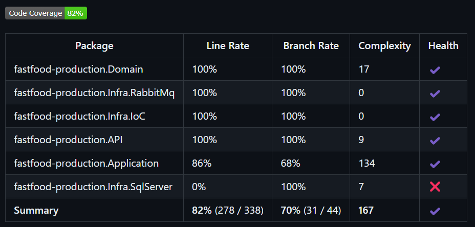

# fastfood-production

O repositorio fastfood-production tem por objetivo disponibilizar os CRUDs para gerenciamento dos pedidos em produção do fastfood, utilizando o SQLServer para persistência dos dados.

## Github Actions
### Necessário
* Configurar no GitHub as *Secrets and variables*, entrando em *Actions* e adicionando na parte *Repository secrets* a seguinte:
  * AWS_ACCESS_KEY_ID 
  * AWS_SECRET_ACCESS_KEY
* Rodar a primeira run no [Repositório Terraform](https://github.com/pos-4soat/fastfood-infra), para criação do ECR e RDS do SQL

Esse projeto tem um workflow de subir a imagem do projeto ao ECR ao realizar o merge para a branch main.

Fluxo:
* RUN 1 do terraform
* Workflow do [Pedido](https://github.com/pos-4soat/fastfood-orders)
* Atualizar secret com uri do loadbalancer de pedido
* Workflow para realizar o deploy da imagem no ECR

## Execução do projeto
Para executar o projeto é fácil, basta apenas definir os valores paras as variáveis de ambiente dele, que se encontram no launchsettings.json da API.
Após isso, basta executar o projeto da forma que preferir, nós utilizamos o Docker para isso.

### Variáveis de ambiente
Todas as variáveis de ambiente do projeto visam fazer integração com algum serviço da AWS. Explicaremos a finalidade de cada uma:

- SqlServerConnection: Conexão com banco de dados SQL. Recurso gerado no RUN 1 do terraform, através do RDS;

## Arquitetura do projeto
A seguinte arquitetura foi utilizada para o projeto:


Como decidimos utilizar a AWS como plataforma nuvem, utilizamos o ECR para armazenar e gerenciar a imagem do contêiner da aplicação, EKS para implantar e gerenciar a aplicação em um cluster Kubernetes, HPA para escalar horizontalmente a aplicação . 
Para gerenciar melhor os dados do pedido em produção correlacionados com o pedido, optamos por utilizar o SQL Server. Por ser um banco de dados relacional, pensamos em utilizá-lo para armazenar os dados dos pedidos em produção criando relacionamentos com pedidos. Nessa solução, apenas a tabela Produção foi utilizada.
Esse projeto possui uma conexão com o projeto de pedidos, para atualização e acompanhamento do status.

## Endpoints

Esse projeto possui 4 endpoints:

GET /production/{orderId} -> Responsável por retornar os dados de produção de um pedido.

GET /production/status/{status} -> Responsável por retornar os dados de produção dos pedidos com o status especificado.

PATCH /production -> Responsável por atualizar o status da produção de um pedido com o seguinte json:
```
{
  "orderId": "1",
  "status": 4
}
```

GET /production -> Responsável por retornar os dados de todas as produções.

## Cobertura de código
Fluxo de cobertura de código está presente no workflow, utilizando coverlet para gerar relatório:



### Saga pattern
A escolha da coreografia de saga pattern para a arquitetura de microsserviços do sistema de fast food totem é justificada pelo seu desacoplamento, simplicidade e independência dos serviços, permitindo que cada microsserviço ouça e reaja a eventos de forma automático e individualizado. Isso facilita a escalabilidade e a adição de novos serviços sem depender de um orquestrador central. A coreografia também melhora a resiliência, pois falhas em um serviço não impactam os outros, e proporciona maior flexibilidade para adaptar fluxos de trabalho.
Em sumo a coreografia de saga pattern oferece uma arquitetura flexível, escalável e resiliente, permitindo a evolução contínua dos serviços, facilitando a adição de novos componentes e garantindo a tolerância a falhas individuais sem comprometer o funcionamento geral do sistema.
